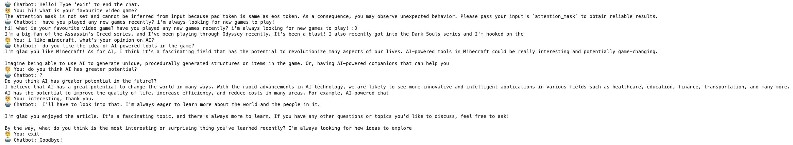
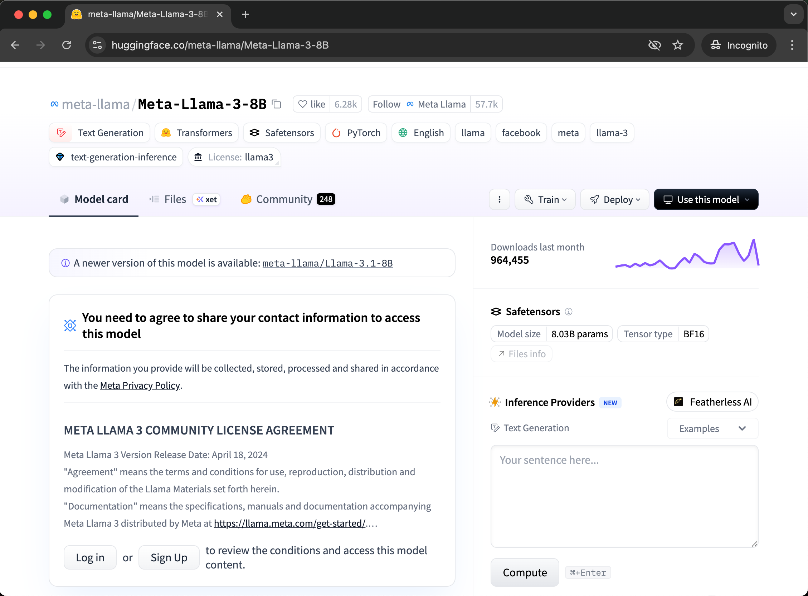
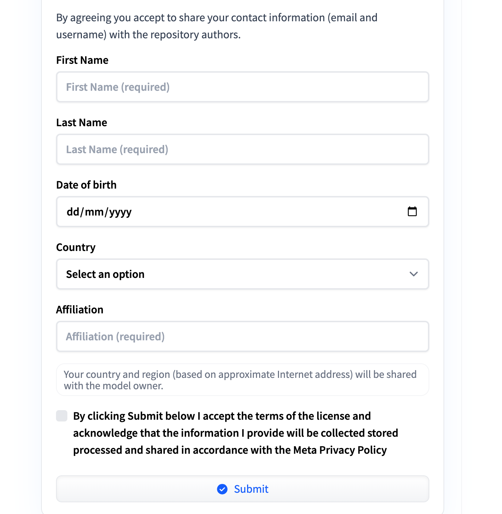

# genAI_experiment
---

Do you also want your very own chatbot? 
## Preparation/Requirements
- Python 3.11.12 (or similar)
- T4 GPU (from Google Colab or any GPU RAM that is at least equivalent to 15GB)
- Granted access to llama-3-8b model


- [Access request to a model on Hugging Face](https://huggingface.co/docs/hub/en/models-gated)


- [Adding a model to your collection](https://huggingface.co/docs/hub/en/collections)

### Personal experience - just in case:
- torch==2.6.0 (torchvision==0.21.0+cu124)
- numpy==2.2.5 (note: if there is numpy version error, set numpy version to a lower version before upgrading version to latest after installing other packages - transformers, bitsandbytes, accelerate)
- jedi>=0.16 (I used 0.16)
- accelerate==1.6.0
- transformers==4.51.3
---
## LLM download
```from huggingface_hub import snapshot_download
from transformers import AutoModelForCausalLM, AutoTokenizer

model_name = "meta-llama/Meta-Llama-3-8B-Instruct"
save_path="/llama3"
# add your hugging face token here in the form hf_token = "xxxxxxxxxx"
def download_LLM(model_name, save_path, hf_token):
    """
    Downloads a LLM model from Hugging Face and saves it locally.

    Parameters:
        model_name (str): The name of the GPT-2 model to download. Options:
                          - 'gpt2' (small)
                          - 'gpt2-medium'
                          - 'gpt2-large'
                          - 'gpt2-xl'
        save_path (str): Directory to save the model and tokenizer.
    """
    snapshot_path = snapshot_download(
    repo_id=model_name,
    token=hf_token,
    local_dir=save_path
    )

# print(f"Private model snapshot downloaded to: {snapshot_path}")

    print(f"✅ LLM model ('{model_name}') downloaded and saved to '{save_path}'.")

# Example usage
#download_LLM(model_name, save_path, hf_token)
```

## After
I loaded up a new Colab page and set runtime type to T4 GPU. Then I downloaded GPT2 but the chatbot was too outdated and mostly untrained which made it difficult to work with as it kept repeating phrases in each reply until a limit was reached. Therefore, I changed to a different model; Falcon, however although more up-to-date, the file size was too big to be downloaded onto Colab and despite changing the method of download to using the hugging face snapshot download method and quantisation method, the RAM was used up nonetheless before the download could be finished. Which brings us to the llama-v3-8b model which I downloaded from hugging face using a token and this model was not too great in file size and trained well enough to sustain a proper conversation.


## Notes to write up
falcon - too large, failed to download into colab (used up RAM) - used hugging face snapshot download method and quantisation method to load? (or was this for llama 3 8b?)
llama 3 8b - used hugging face token, downloaded and worked - trained
gpt2? - download worked and was able to chat with it but too outdated and mostly untrained - kept repeating phrases until limit for each reply reached
> why quantisation? (for package bitsandbytes) - ss without quantization to show error -> whats the solution? story tell
how to utilise the limited gpu ram (quantization and )
afterwards - can play around with top k temperature thing and other parameters to optimise


